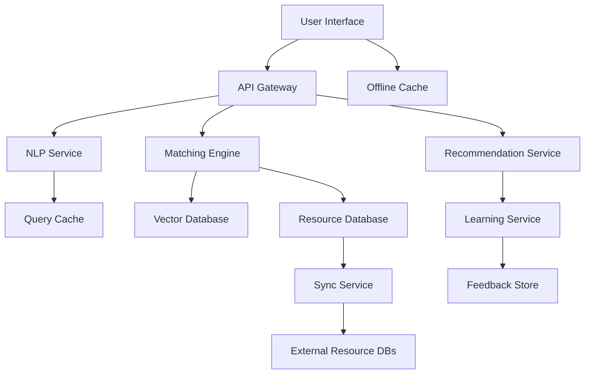

# Design Document: Community Resource Navigator

## Overview

The Community Resource Navigator is an AI-powered platform that connects underserved communities with relevant resources through natural language interaction. The system employs modern NLP techniques, semantic search, and machine learning to understand user needs, match them with appropriate resources, and continuously improve through feedback.

### Core Design Principles

1. **User-Centric Design**: Prioritize simplicity and accessibility for users with varying technical literacy
2. **Privacy-First**: Minimize data collection and provide anonymous access options
3. **Explainability**: Ensure all AI decisions can be explained in plain language
4. **Offline-Capable**: Support users in low-connectivity environments
5. **Multilingual by Default**: Treat all languages as first-class citizens, not afterthoughts
6. **Continuous Learning**: Improve matching quality through feedback loops

### Technology Approach

- **NLP Engine**: Use transformer-based models (e.g., multilingual BERT variants) for query understanding and semantic matching
- **Vector Search**: Employ embedding-based similarity search for resource matching
- **Lightweight Architecture**: Design for deployment in resource-constrained environments
- **Progressive Web App**: Enable offline functionality and cross-platform access

## Architecture

### High-Level Architecture



### Component Interaction Flow

1. **Query Processing Flow**:
   - User submits query → API Gateway → NLP Service
   - NLP Service extracts intent, entities, and context
   - Query embeddings generated for semantic search
   - Results cached for similar future queries

2. **Matching Flow**:
   - Query embeddings → Vector Database for similarity search
   - Candidate resources retrieved → Eligibility filtering
   - Context-based ranking → Personalization layer
   - Top matches returned with explanations

3. **Learning Flow**:
   - User feedback collected → Feedback Store
   - Learning Service analyzes patterns periodically
   - Model fine-tuning on successful/unsuccessful matches
   - Updated embeddings deployed to Vector Database

## Components and Interfaces

### 1. NLP Service

**Responsibility**: Process natural language queries and extract structured information

**Key Functions**:
- `parse_query(text: str, language: str) -> QueryIntent`
- `extract_entities(text: str) -> List[Entity]`
- `detect_language(text: str) -> str`
- `generate_embedding(text: str) -> Vector`
- `clarify_ambiguity(query: QueryIntent) -> List[Question]`

**Interface**:
```
QueryIntent {
  primary_need: str          // e.g., "housing", "healthcare"
  secondary_needs: List[str] // additional needs mentioned
  urgency: str              // "immediate", "soon", "planning"
  entities: List[Entity]    // extracted locations, demographics, etc.
  confidence: float         // confidence in interpretation
  language: str            // detected language code
}

Entity {
  type: str                // "location", "age", "income", etc.
  value: str               // extracted value
  normalized: Any          // normalized representation
}
```

**Implementation Notes**:
- Use multilingual sentence transformers (e.g., `paraphrase-multilingual-mpnet-base-v2`)
- Implement language detection using `langdetect` or similar
- Cache embeddings with TTL to reduce computation
- Support batch processing for efficiency

### 2. Matching Engine

**Responsibility**: Find and rank resources based on query and user context

**Key Functions**:
- `find_candidates(query_embedding: Vector, top_k: int) -> List[Resource]`
- `filter_by_eligibility(resources: List[Resource], context: UserContext) -> List[Resource]`
- `rank_by_relevance(resources: List[Resource], query: QueryIntent, context: UserContext) -> List[ScoredResource]`
- `explain_match(resource: Resource, query: QueryIntent) -> Explanation`

**Interface**:
```
UserContext {
  location: Optional[Location]
  language_preference: str
  accessibility_needs: List[str]
  demographics: Optional[Demographics]
  previous_queries: List[QueryIntent]
}

ScoredResource {
  resource: Resource
  relevance_score: float
  eligibility_match: float
  explanation: Explanation
}

Explanation {
  why_matched: str          // plain language explanation
  key_factors: List[str]    // bullet points of matching factors
  eligibility_status: str   // "likely eligible", "may qualify", etc.
}
```

**Ranking Algorithm**:
```
final_score = (
  0.5 * semantic_similarity +
  0.2 * eligibility_match +
  0.15 * geographic_proximity +
  0.1 * resource_availability +
  0.05 * historical_success_rate
)
```

### 3. Recommendation Service

**Responsibility**: Generate personalized, explainable recommendations

**Key Functions**:
- `generate_recommendations(query: QueryIntent, context: UserContext, limit: int) -> RecommendationSet`
- `personalize(resources: List[ScoredResource], context: UserContext) -> List[ScoredResource]`
- `generate_explanations(recommendations: List[ScoredResource]) -> List[Explanation]`
- `simplify_eligibility(criteria: EligibilityCriteria) -> SimplifiedCriteria`

**Interface**:
```
RecommendationSet {
  recommendations: List[Recommendation]
  total_found: int
  query_interpretation: str
  suggestions_for_refinement: List[str]
}

Recommendation {
  resource: Resource
  match_score: float
  explanation: Explanation
  eligibility_guidance: SimplifiedCriteria
  next_steps: List[str]
}

SimplifiedCriteria {
  requirements: List[Requirement]
  likely_eligible: bool
  missing_information: List[str]
  documentation_needed: List[str]
}
```

### 4. Resource Database

**Responsibility**: Store and manage resource information

**Schema**:
```
Resource {
  id: str
  name: str
  description: str
  category: str                    // healthcare, housing, education, etc.
  subcategories: List[str]
  provider: Organization
  location: Location
  service_area: GeographicArea
  languages_supported: List[str]
  accessibility_features: List[str]
  eligibility_criteria: EligibilityCriteria
  contact_info: ContactInfo
  hours_of_operation: Schedule
  capacity_status: str             // "accepting", "waitlist", "full"
  last_verified: datetime
  embedding: Vector                // for semantic search
}

EligibilityCriteria {
  income_requirements: Optional[IncomeRange]
  age_requirements: Optional[AgeRange]
  residency_requirements: Optional[List[str]]
  documentation_required: List[str]
  other_criteria: List[Criterion]
}
```

**Indexes**:
- Vector index on `embedding` for similarity search
- Geographic index on `location` for proximity queries
- Text index on `name`, `description`, `category` for keyword fallback
- Composite index on `category` + `capacity_status` for filtering

### 5. Learning Service

**Responsibility**: Improve matching quality through feedback analysis

**Key Functions**:
- `record_feedback(query_id: str, resource_id: str, feedback: Feedback) -> void`
- `analyze_patterns() -> InsightReport`
- `update_embeddings(insights: InsightReport) -> void`
- `identify_gaps() -> List[ResourceGap]`

**Interface**:
```
Feedback {
  query_id: str
  resource_id: str
  was_helpful: bool
  rating: Optional[int]          // 1-5 scale
  comment: Optional[str]
  issue_type: Optional[str]      // "outdated", "incorrect", "not_relevant"
  timestamp: datetime
}

InsightReport {
  successful_patterns: List[Pattern]
  unsuccessful_patterns: List[Pattern]
  resource_gaps: List[ResourceGap]
  suggested_improvements: List[str]
}

Pattern {
  query_characteristics: Dict
  resource_characteristics: Dict
  success_rate: float
  sample_size: int
}
```

**Learning Approach**:
- Collect feedback continuously
- Batch process weekly for pattern analysis
- Fine-tune embeddings monthly based on successful matches
- Use contrastive learning: pull successful matches closer, push unsuccessful matches apart

### 6. Translation Service

**Responsibility**: Provide accurate, culturally-aware translations

**Key Functions**:
- `translate(text: str, source_lang: str, target_lang: str) -> str`
- `translate_with_context(text: str, context: str, source_lang: str, target_lang: str) -> str`
- `detect_and_translate(text: str, target_lang: str) -> str`

**Implementation Notes**:
- Use neural machine translation models (e.g., MarianMT, NLLB)
- Cache translations to reduce API costs
- Provide context (e.g., "healthcare", "legal") for domain-specific translation
- Fall back to simpler models for offline mode

### 7. API Gateway

**Responsibility**: Handle authentication, rate limiting, and request routing

**Endpoints**:
```
POST /api/v1/query
  Body: { query: str, context: UserContext }
  Response: RecommendationSet

POST /api/v1/feedback
  Body: Feedback
  Response: { success: bool }

GET /api/v1/resource/{id}
  Response: Resource

POST /api/v1/clarify
  Body: { query_id: str, clarification: Dict }
  Response: RecommendationSet

GET /api/v1/languages
  Response: List[Language]
```

**Security**:
- Optional authentication (allow anonymous queries)
- Rate limiting: 100 requests/hour per IP for anonymous, 1000/hour for authenticated
- Input validation and sanitization
- CORS configuration for web clients

## Data Models

### Core Data Structures

**Query Processing**:
```python
class Query:
    id: str
    text: str
    language: str
    timestamp: datetime
    user_context: UserContext
    intent: QueryIntent
    embedding: Vector

class UserContext:
    session_id: str
    location: Optional[Location]
    language_preference: str
    accessibility_needs: List[str]
    demographics: Optional[Demographics]
    is_anonymous: bool
```

**Resource Representation**:
```python
class Resource:
    id: str
    name: str
    description: str
    category: ResourceCategory
    provider: Organization
    location: Location
    service_area: GeographicArea
    eligibility: EligibilityCriteria
    contact: ContactInfo
    metadata: ResourceMetadata
    embedding: Vector

class ResourceMetadata:
    languages: List[str]
    accessibility: List[str]
    capacity_status: CapacityStatus
    last_verified: datetime
    verification_source: str
    tags: List[str]
```

**Matching and Ranking**:
```python
class Match:
    query_id: str
    resource_id: str
    scores: MatchScores
    explanation: Explanation
    timestamp: datetime

class MatchScores:
    semantic_similarity: float
    eligibility_match: float
    geographic_proximity: float
    availability: float
    historical_success: float
    final_score: float
```

### Database Schema

**Primary Database (PostgreSQL)**:
- `resources` - Core resource information
- `organizations` - Resource providers
- `eligibility_rules` - Structured eligibility criteria
- `feedback` - User feedback records
- `query_log` - Query history (anonymized)

**Vector Database (Qdrant/Pinecone)**:
- Resource embeddings with metadata filters
- Query embeddings for caching

**Cache Layer (Redis)**:
- Query results (TTL: 1 hour)
- Resource availability status (TTL: 15 minutes)
- Translation cache (TTL: 7 days)

## Error Handling

### Error Categories

1. **User Input Errors**:
   - Empty or invalid queries → Prompt for clarification
   - Unsupported language → Offer supported languages
   - Ambiguous queries → Ask clarifying questions

2. **System Errors**:
   - NLP service unavailable → Fall back to keyword search
   - Vector database timeout → Return cached results or top resources
   - Translation service failure → Return English with apology message

3. **Data Errors**:
   - Resource not found → Log and remove from recommendations
   - Outdated resource information → Flag for review
   - Invalid eligibility criteria → Skip eligibility filtering

### Error Response Format

```json
{
  "success": false,
  "error": {
    "code": "AMBIGUOUS_QUERY",
    "message": "I need a bit more information to help you better.",
    "user_message": "Could you tell me more about what type of help you're looking for?",
    "clarifying_questions": [
      "Are you looking for immediate emergency assistance?",
      "What area or neighborhood are you in?"
    ],
    "recoverable": true
  }
}
```

### Graceful Degradation

- **NLP Service Down**: Use keyword matching and category filtering
- **Vector Search Unavailable**: Fall back to traditional database queries
- **Translation Service Down**: Serve English content with notification
- **Low Confidence Matches**: Present broader category results with disclaimer

## Testing Strategy

### Testing Approach

The Community Resource Navigator requires both traditional unit testing and property-based testing to ensure correctness across diverse inputs and scenarios.

**Unit Tests**: Focus on specific examples, edge cases, and integration points
- Test specific query interpretations with known inputs
- Verify error handling for malformed requests
- Test integration between components
- Validate translation accuracy for sample phrases
- Test eligibility filtering logic with specific scenarios

**Property-Based Tests**: Verify universal properties across all inputs
- Test that the system handles all valid queries without crashing
- Verify that recommendations always include explanations
- Ensure ranking scores are consistent and within valid ranges
- Test that multilingual queries produce equivalent results
- Validate that feedback loops don't degrade performance

### Testing Tools

- **Unit Testing**: pytest (Python), Jest (TypeScript/JavaScript)
- **Property-Based Testing**: Hypothesis (Python), fast-check (TypeScript)
- **Integration Testing**: pytest with test containers
- **Load Testing**: Locust or k6
- **Accessibility Testing**: axe-core, WAVE

### Test Configuration

- Property-based tests: minimum 100 iterations per test
- Each property test tagged with: **Feature: community-resource-navigator, Property {N}: {description}**
- CI/CD pipeline runs all tests on every commit
- Nightly runs with 1000 iterations for property tests


## Correctness Properties

*A property is a characteristic or behavior that should hold true across all valid executions of a system—essentially, a formal statement about what the system should do. Properties serve as the bridge between human-readable specifications and machine-verifiable correctness guarantees.*

### Query Processing Properties

**Property 1: Query parsing completeness**
*For any* natural language query in a supported language, the Navigator should successfully parse it and return a QueryIntent object with all required fields (primary_need, language, confidence) populated.
**Validates: Requirements 1.1**

**Property 2: Ambiguity detection**
*For any* query that contains ambiguous terms or insufficient information, the Navigator should identify the ambiguity and return clarifying questions rather than making assumptions.
**Validates: Requirements 1.2**

**Property 3: Query processing performance**
*For any* submitted query, the Navigator should complete processing and return results within 3 seconds under normal load conditions.
**Validates: Requirements 1.3**

**Property 4: Query complexity handling**
*For any* query ranging from simple single-need requests to complex multi-faceted situations, the Navigator should process it without errors and return valid results.
**Validates: Requirements 1.4**

**Property 5: Context extraction**
*For any* query containing context indicators (location mentions, urgency markers, demographic information), the Navigator should extract and include them in the QueryIntent entities list.
**Validates: Requirements 1.5**

### Matching and Ranking Properties

**Property 6: Semantic matching**
*For any* query and resource pair with high semantic similarity but different keywords, the Navigator should identify them as a match with a relevance score above the threshold.
**Validates: Requirements 2.1**

**Property 7: Ranking consistency**
*For any* set of resources matching a query, the Navigator should produce a deterministic ranking where resources with higher relevance scores appear before those with lower scores.
**Validates: Requirements 2.2**

**Property 8: Eligibility evaluation**
*For any* resource with eligibility criteria and user context, the Navigator should correctly evaluate whether the user meets the criteria and reflect this in the eligibility_match score.
**Validates: Requirements 2.3**

**Property 9: Availability prioritization**
*For any* set of matching resources, those marked as "accepting" should rank higher than those marked as "waitlist" or "full", all else being equal.
**Validates: Requirements 2.5**

### Personalization Properties

**Property 10: Geographic prioritization**
*For any* query with location context, resources geographically closer to the user should rank higher than distant resources with similar relevance scores.
**Validates: Requirements 3.1**

**Property 11: Language preference matching**
*For any* user with a specified language preference, resources offering services in that language should rank higher than resources not offering that language.
**Validates: Requirements 3.2**

**Property 12: Accessibility filtering**
*For any* user with indicated accessibility needs, all returned recommendations should include only resources that meet those accessibility requirements.
**Validates: Requirements 3.3**

**Property 13: Demographic targeting**
*For any* user with provided demographic information, resources specifically designed for that demographic should rank higher than general resources.
**Validates: Requirements 3.4**

**Property 14: Feedback-based adaptation**
*For any* resource that receives positive feedback for a query type, subsequent similar queries should rank that resource higher than before the feedback was received.
**Validates: Requirements 3.5**

### Multilingual Properties

**Property 15: Language response consistency**
*For any* query submitted in a supported language (English, Spanish, Mandarin, Arabic), the Navigator should return all response text in that same language.
**Validates: Requirements 4.2**

**Property 16: Language detection accuracy**
*For any* query in a supported language, the Navigator should correctly detect the language without requiring explicit language selection.
**Validates: Requirements 4.5**

### Explainability Properties

**Property 17: Explanation presence**
*For any* recommendation returned to a user, the recommendation should include a non-empty explanation field describing why the resource was matched.
**Validates: Requirements 5.1**

**Property 18: Eligibility explanation**
*For any* recommendation where eligibility criteria were evaluated, the explanation should mention which specific criteria the user appears to meet or not meet.
**Validates: Requirements 5.2**

### Eligibility Guidance Properties

**Property 19: Eligibility categorization**
*For any* resource with eligibility criteria, the Navigator should organize the requirements into standard categories (income, residency, age, documentation) in the SimplifiedCriteria output.
**Validates: Requirements 6.2**

**Property 20: Missing information identification**
*For any* eligibility evaluation where the determination is uncertain, the Navigator should list the specific information needed to make a complete determination.
**Validates: Requirements 6.3**

**Property 21: Step-by-step guidance**
*For any* resource recommendation, the Navigator should provide eligibility verification guidance in a structured step-by-step format.
**Validates: Requirements 6.4**

**Property 22: Documentation requirements listing**
*For any* resource with documentation requirements in its eligibility criteria, the Navigator should extract and list all required documents in the SimplifiedCriteria.
**Validates: Requirements 6.5**

### Learning Properties

**Property 23: Feedback persistence**
*For any* feedback submitted by a user, the feedback should be stored in the Feedback Store and be retrievable by query_id and resource_id.
**Validates: Requirements 7.1**

**Property 24: Positive feedback learning**
*For any* resource that receives positive feedback for a specific query type, the resource's ranking should improve for similar subsequent queries compared to its ranking before the feedback.
**Validates: Requirements 7.2**

**Property 25: Negative feedback learning**
*For any* resource that receives negative feedback for a specific query type, the resource's ranking should decrease for similar subsequent queries compared to its ranking before the feedback.
**Validates: Requirements 7.3**

**Property 26: Privacy in learning**
*For any* feedback data stored for learning purposes, the data should not contain personally identifiable information (PII) such as names, addresses, or unique identifiers.
**Validates: Requirements 7.5**

### Accessibility Properties

**Property 27: Alt text presence**
*For any* non-text content (images, icons, charts) presented in the interface, the HTML should include a non-empty alt attribute or aria-label.
**Validates: Requirements 8.4**

### Privacy Properties

**Property 28: Data deletion completeness**
*For any* user who requests data deletion, all associated personal information should be permanently removed from all storage systems and not be retrievable after the deletion is processed.
**Validates: Requirements 9.5**

### Offline Support Properties

**Property 29: Offline query synchronization**
*For any* queries submitted while offline, when connectivity is restored, all queued queries should be processed and recommendations should be returned to the user.
**Validates: Requirements 10.4**

### Feedback Mechanism Properties

**Property 30: Feedback acknowledgment**
*For any* feedback submission, the Navigator should return an acknowledgment response confirming receipt and explaining how the feedback will be used.
**Validates: Requirements 11.3**

**Property 31: Resource flagging**
*For any* report of incorrect or outdated resource information, the Navigator should mark that resource with a flag for administrative review in the database.
**Validates: Requirements 11.5**

### Resource Integration Properties

**Property 32: Sync timeliness**
*For any* resource update in an external database, the Navigator should detect and synchronize the change within 24 hours of the update timestamp.
**Validates: Requirements 12.2**

**Property 33: Data validation**
*For any* incoming resource data from external sources, the Navigator should validate completeness (required fields present) and consistency (valid values) before storing it.
**Validates: Requirements 12.3**

**Property 34: Unavailable resource filtering**
*For any* resource marked as unavailable or at capacity, the Navigator should exclude it from recommendation results for all queries.
**Validates: Requirements 12.4**

### Round-Trip and Invariant Properties

**Property 35: Query embedding consistency**
*For any* query text, generating an embedding twice should produce vectors with cosine similarity above 0.99 (accounting for floating-point precision).
**Validates: Requirements 1.1**

**Property 36: Score normalization**
*For any* recommendation set, all relevance scores should be normalized to the range [0.0, 1.0] with the highest-ranked resource having the maximum score.
**Validates: Requirements 2.2**

**Property 37: Context preservation**
*For any* user context provided with a query, all context fields should be preserved and accessible throughout the matching and ranking pipeline.
**Validates: Requirements 2.4, 3.1, 3.2, 3.3, 3.4**


## Implementation Notes

### Technology Stack Recommendations

**Backend**:
- **Language**: Python 3.10+ (excellent ML/NLP library support)
- **Framework**: FastAPI (async support, automatic API documentation)
- **NLP**: Hugging Face Transformers, sentence-transformers
- **Vector Database**: Qdrant (open-source, self-hostable) or Pinecone (managed)
- **Primary Database**: PostgreSQL with PostGIS extension
- **Cache**: Redis
- **Task Queue**: Celery with Redis broker

**Frontend**:
- **Framework**: React or Vue.js with TypeScript
- **PWA**: Workbox for offline support
- **Accessibility**: React Aria or Radix UI for accessible components
- **State Management**: React Query or TanStack Query

**ML/NLP Models**:
- **Multilingual Embeddings**: `paraphrase-multilingual-mpnet-base-v2`
- **Translation**: MarianMT models or NLLB-200
- **Language Detection**: `langdetect` or `fasttext`

### Deployment Considerations

**Scalability**:
- Horizontal scaling for API servers
- Vector database sharding by resource category
- Read replicas for PostgreSQL
- CDN for static assets and cached responses

**Monitoring**:
- Query latency tracking
- Match quality metrics (click-through rate, feedback scores)
- Error rates by component
- Resource database freshness

**Security**:
- Rate limiting per IP and per session
- Input sanitization for all user queries
- SQL injection prevention (parameterized queries)
- XSS prevention in frontend
- Regular security audits

### Performance Optimization

**Query Processing**:
- Cache embeddings for common queries (TTL: 1 hour)
- Batch embedding generation when possible
- Use approximate nearest neighbor search (HNSW) for vector similarity

**Resource Matching**:
- Pre-filter by category before vector search
- Use geographic indexes for location-based filtering
- Implement result pagination (limit: 20 per page)

**Translation**:
- Cache translations with 7-day TTL
- Pre-translate common resource descriptions
- Use smaller models for offline mode

### Data Privacy Measures

**Anonymization**:
- Generate session IDs that don't contain user information
- Hash IP addresses before logging
- Remove PII from query logs after 30 days

**Data Minimization**:
- Don't require authentication for basic queries
- Only collect location at city/zip code level, not precise coordinates
- Allow users to opt out of personalization

**Compliance**:
- GDPR: Right to access, right to deletion, data portability
- CCPA: Disclosure of data collection, opt-out mechanisms
- HIPAA: If handling health information, ensure BAA with providers

## Future Enhancements

### Phase 2 Features

1. **Voice Interface**: Support voice queries for accessibility and convenience
2. **SMS Interface**: Allow queries via text message for users without smartphones
3. **Resource Booking**: Enable direct appointment scheduling through the platform
4. **Community Feedback**: Allow resource providers to respond to feedback
5. **Impact Tracking**: Measure outcomes and success rates for resources

### Phase 3 Features

1. **Predictive Needs**: Anticipate future needs based on user journey patterns
2. **Resource Gap Analysis**: Identify underserved needs in communities
3. **Multi-Agency Coordination**: Help users navigate multi-step processes across agencies
4. **Peer Support**: Connect users with similar needs for mutual support
5. **Provider Analytics**: Give resource providers insights into demand and gaps

## Appendix

### Example Query Flow

```
User Query: "I just lost my job and need help paying rent this month. I have two kids."

1. NLP Processing:
   - Primary need: "housing assistance"
   - Secondary needs: ["financial assistance", "employment"]
   - Urgency: "immediate"
   - Entities: [
       {type: "family_size", value: "3"},
       {type: "employment_status", value: "unemployed"},
       {type: "need_type", value: "emergency"}
     ]

2. Vector Search:
   - Query embedding generated
   - Top 50 candidate resources retrieved
   - Categories: emergency rental assistance, unemployment benefits, family services

3. Eligibility Filtering:
   - Filter by family size (programs for families with children)
   - Filter by employment status (programs for unemployed)
   - Filter by urgency (emergency assistance programs)

4. Ranking:
   - Emergency rental assistance programs (highest relevance)
   - Unemployment benefits (high relevance)
   - Food assistance programs (medium relevance)
   - Job training programs (lower relevance for immediate need)

5. Personalization:
   - Prioritize by user's location
   - Filter by language preference
   - Boost programs with high success rates

6. Response:
   Top 3 Recommendations:
   1. Emergency Rental Assistance Program
      - Why: Provides immediate rent payment assistance for families
      - Eligibility: Recently unemployed, have children, income below 80% AMI
      - Next steps: Call (555) 123-4567 or apply online
      
   2. Unemployment Insurance Benefits
      - Why: Provides income replacement while job searching
      - Eligibility: Recently lost job through no fault of your own
      - Next steps: File claim at state unemployment website
      
   3. Family Crisis Center
      - Why: Offers emergency financial assistance and case management
      - Eligibility: Families with children facing financial crisis
      - Next steps: Walk-in hours Mon-Fri 9am-5pm
```

### Glossary of Technical Terms

- **Embedding**: A dense vector representation of text that captures semantic meaning
- **Cosine Similarity**: A measure of similarity between two vectors (ranges from -1 to 1)
- **HNSW**: Hierarchical Navigable Small World, an algorithm for approximate nearest neighbor search
- **Transformer**: A neural network architecture used for NLP tasks
- **Fine-tuning**: Adapting a pre-trained model to a specific task or domain
- **Contrastive Learning**: A learning approach that pulls similar examples together and pushes dissimilar examples apart
- **Progressive Web App (PWA)**: A web application that can work offline and be installed like a native app
